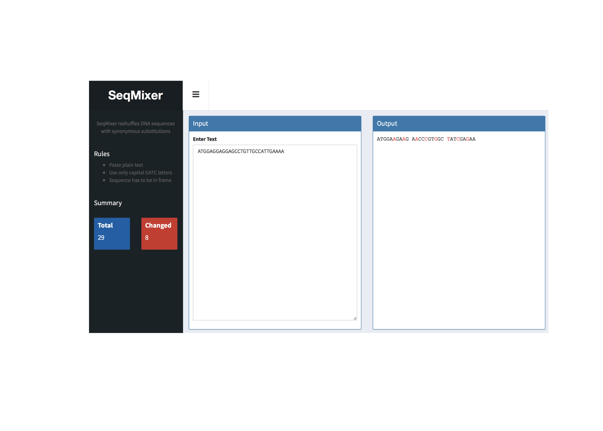

## SeqMixer

This is a Shiny app to shuffle DNA sequences while maintaining the encoded amino acid sequence.

* Input: text insert
* Substitutes based on codon usage (current: Drosophila)
* Output: mixed sequence

## Installation

* Use the online version: https://tschauer.shinyapps.io/SeqMixer/

OR

* Download the app.R file
* Open the file in RStudio
* Install the required packages (see in the file)
* Run app

## Example

